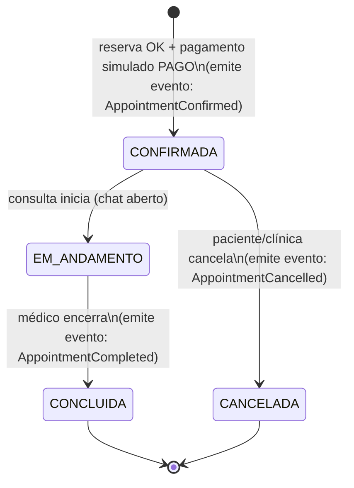
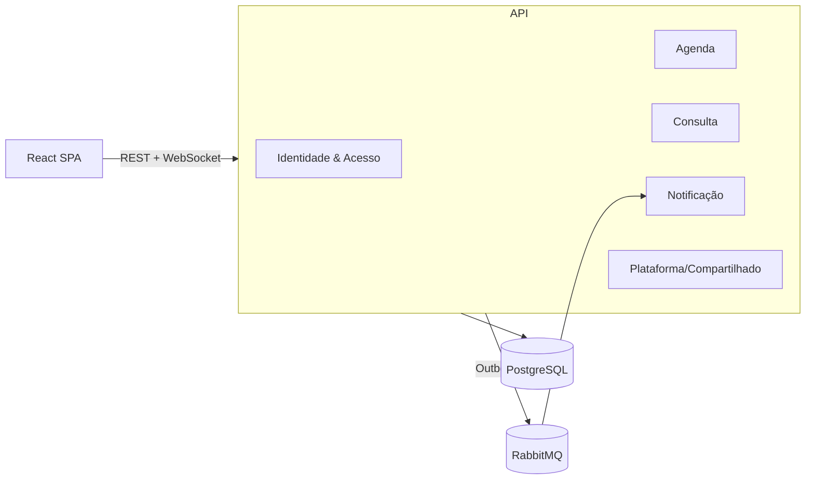
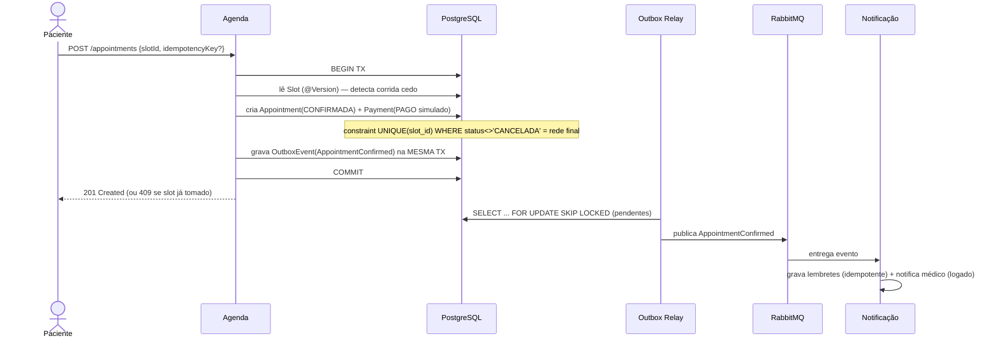
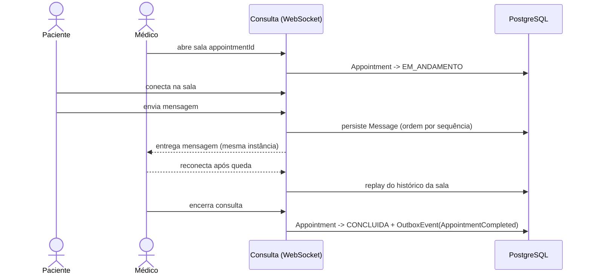

# Plataforma de Teleconsulta

SaaS de teleconsulta: o paciente agenda uma consulta com um médico da clínica e a
realiza por **chat em tempo real**. Pagamento simulado, lembretes automáticos e
dado clínico protegido.

**Em uma frase:** projeto pequeno em features e grande em arquitetura — desenhado
para resolver, de verdade, dois problemas que muitos sistemas só fingem resolver.

### Destaques técnicos

- **Reserva sem conflito sob concorrência.** Dois pacientes clicando no mesmo
  horário no mesmo instante: o sistema confirma exatamente um e rejeita o outro
  com `409` — garantido por *constraint* no banco + lock otimista, com teste
  automatizado que reproduz a condição de corrida.
- **Eventos confiáveis (transactional outbox + RabbitMQ).** Consulta confirmada →
  lembrete *sempre* disparado: o evento é gravado na mesma transação do dado e
  publicado por um *relay* idempotente com *dead-letter queue*. Nunca "salvou mas
  perdeu a notificação".
- **Chat em tempo real** via WebSocket/STOMP, histórico persistido e *replay* na
  reconexão.
- **Escopo com decisões explícitas.** Multi-tenant, escala horizontal de WebSocket
  e *blind index* ficaram *deliberadamente* fora do MVP e documentados como
  evolução — saber o que **não** construir é parte do design.

### Stack

- `Java 21` 
· `Spring Boot 4` 
· `PostgreSQL` 
· `RabbitMQ` 
· `WebSocket/STOMP` 
·`Spring Security/JWT` 
· `React` 
· `Docker Compose`

### Status

Em desenvolvimento — roadmap em 8 fases (seção 9). Sobe inteiro com
`docker compose up`.

---

> **Como ler:** seções 1–4 são o panorama; 5–8, o detalhe de engenharia
> (arquitetura, ADRs, fluxos); o glossário ao final traduz os termos técnicos.
> Marcadores no texto: 🎯 desafio central de engenharia · ✅ padrão, sem novidade ·
> 🚫 fora de escopo (decisão consciente).

---

## 1. Visão Geral

Plataforma de **teleconsulta** de uma clínica: a clínica tem médicos; um paciente
agenda uma consulta em um horário livre e a realiza por **chat em tempo real**. O
ciclo da consulta é rastreado por uma máquina de estados, o pagamento é simulado e
os lembretes são enviados de forma assíncrona.

O domínio foi escolhido porque ele **força** alguns problemas reais de arquitetura
(concorrência e mensageria confiável) sem virar um amontoado de CRUDs.

> **Decisão de escopo (b):** o sistema atende **uma clínica só**. "Multi-tenant"
> (várias clínicas isoladas no mesmo sistema) fica como fase futura — ver ADR-003.

## 2. Objetivo

Demonstrar **design de sistema** — profundidade de arquitetura, não amplitude de
features. Cada feature do MVP foi escolhida por exercitar uma decisão de engenharia
defensável.

## 3. Escopo

### 3.1 Dentro do MVP

| Item | Dificuldade |
|---|---|
| Autenticação + RBAC: papéis `PACIENTE`, `MEDICO`, `ADMIN_CLINICA`; JWT + refresh token | ✅ Simples |
| Disponibilidade do médico: template semanal → geração de horários (slots) | ✅ Simples |
| **Reserva de slot segura sob concorrência** | 🎯 **Difícil #1** |
| Ciclo da consulta como **máquina de estados** | ✅ Simples (a máquina) |
| **Transactional outbox + RabbitMQ** (evento confiável → lembrete) | 🎯 **Difícil #2** |
| Chat da consulta em tempo real (WebSocket/STOMP) — **uma instância só** | ✅ Médio |
| Pagamento **simulado** (estado `PAGO` + evento de domínio, sem gateway) | ✅ Simples |
| Lembretes/notificações assíncronos (adapter de envio **simulado/logado**) | ✅ Simples |
| Dado sensível: criptografia de campo **simples** + log de auditoria + consentimento | ✅ Médio |
| Observabilidade básica: logs estruturados + correlation id (HTTP → fila) | ✅ Simples |
| Testes de integração com Testcontainers, **incluindo o teste de corrida** | ✅ Médio |

### 3.2 Fora do MVP (decisões conscientes)

- 🚫 **Multi-tenancy** (várias clínicas isoladas). Não é difícil em um ponto — é
  difícil porque **contamina toda query, todo teste e o consumidor de fila**. Uma
  clínica só remove uma fonte enorme de complexidade. → fase futura (ADR-003).
- 🚫 **Backplane Redis / WebSocket horizontalmente escalável.** O chat roda numa
  instância só. Escalar WebSocket horizontalmente é um problema legítimo, mas é o
  3º difícil — fora do recorte (b). → fase futura (ADR-005).
- 🚫 **Blind index / busca por CPF criptografado.** Criptografamos o campo, mas não
  damos busca por CPF criptografado no MVP. → ADR-007.
- 🚫 Vídeo/WebRTC; gateway de pagamento real; provider real de e-mail/SMS;
  prontuário/receita; BI; billing de SaaS; mobile; i18n; Kubernetes.

## 4. Stack (travada)

| Camada | Tecnologia | Observação |
|---|---|---|
| Linguagem/Runtime | Java 21 | virtual threads opcional, não obrigatório |
| Framework | Spring Boot 3 | |
| Persistência | PostgreSQL + Flyway | banco é a fonte da verdade |
| Mensageria | RabbitMQ (Spring AMQP) | base do **Difícil #2** |
| Tempo real | Spring WebSocket / STOMP | **uma instância** (sem backplane) |
| Segurança | Spring Security + JWT | |
| Frontend | React | mantido enxuto (não é o foco) |
| Deploy | Docker + Docker Compose | `docker compose up` sobe tudo |

> **Redis ficou fora do MVP por decisão de escopo.** Só se justificaria como
> backplane de WebSocket (escala horizontal), que é fase futura. Sem essa
> necessidade, não vale carregar mais uma peça de infraestrutura.

## 5. Arquitetura

### 5.1 Estilo

**Monólito modular.** Um único processo Spring Boot, mas o código é organizado em
**módulos por assunto** (pastas com fronteira clara), não em uma pasta só. Não é
microserviço — microserviço seria complexidade prematura para um projeto solo e
diluiria o aprendizado. Ver ADR-001.

### 5.2 Módulos (bounded contexts)

Pensa em cada módulo como uma área do sistema que poderia, no futuro, virar um
serviço separado — mas hoje é só uma pasta que **não bagunça com as outras**.

1. **Identidade & Acesso** — usuários, papéis, login, JWT.
2. **Agenda** — disponibilidade do médico e geração de horários; **a reserva**
   (aqui mora o Difícil #1).
3. **Consulta** — a máquina de estados da consulta, o chat, e a **emissão de
   eventos via outbox** (aqui mora o Difícil #2).
4. **Notificação** — fica ouvindo eventos e dispara lembretes (envio simulado/logado).
5. **Plataforma/Compartilhado** — coisas transversais: auditoria, logs com
   correlation id, e a "engrenagem" do outbox.

Regra de disciplina: módulos conversam por **interface/evento**, não chamando o
banco um do outro direto. Isso é o que mantém o monólito "modular" e não "monolito-bola-de-lama".

### 5.3 Modelo de domínio (entidades principais)

`Clinic` (única, basicamente configuração), `User`, `Doctor`, `Patient`,
`AvailabilityTemplate`, `Slot`, `Appointment` (**raiz do agregado** — é quem
controla a máquina de estados), `Payment`, `Message` (chat), `OutboxEvent`,
`AuditLog`, `Consent`.

> Não há coluna `tenant_id` em lugar nenhum no MVP. Multi-tenant é fase futura.

### 5.4 Máquina de estados da `Appointment`

Estados:

- `CONFIRMADA` — criada após reserva bem-sucedida + pagamento simulado `PAGO`.
- `EM_ANDAMENTO` — quando a consulta (chat) começa.
- `CONCLUIDA` — o médico encerra a consulta.
- `CANCELADA` — paciente ou clínica cancela antes do início.

Regras (guards) — quem pode disparar o quê:

| Transição | Quem dispara | Emite evento no outbox? |
|---|---|---|
| → `CONFIRMADA` | sistema (após reserva) | **Sim** — `AppointmentConfirmed` |
| `CONFIRMADA` → `CANCELADA` | paciente ou `ADMIN_CLINICA` | **Sim** — `AppointmentCancelled` |
| `CONFIRMADA` → `EM_ANDAMENTO` | médico (ao abrir o chat) | Não |
| `EM_ANDAMENTO` → `CONCLUIDA` | médico | **Sim** — `AppointmentCompleted` |

Qualquer transição não listada é **proibida** e deve falhar com erro claro (ex.:
não dá pra `CONCLUIDA` direto de `CONFIRMADA`). `NAO_COMPARECEU` (no-show) fica
como melhoria futura — não complica o MVP.

### 5.5 Diagrama de componentes

## 6. Decisões de Arquitetura (ADRs)

> ADR = *Architecture Decision Record*: registro curto do **que** foi decidido e
> **por quê** — para a escolha continuar compreensível depois (inclusive em uma
> entrevista técnica).

- **ADR-001 — Monólito modular, não microserviços.** Fronteiras por módulo +
  eventos internos. Evita complexidade operacional prematura num projeto solo.

- **ADR-002 — Concorrência na reserva (Difícil #1).** A garantia **final** é uma
  **constraint única parcial** no banco: não pode existir mais de uma `Appointment`
  ativa para o mesmo `slot_id` (`UNIQUE(slot_id) WHERE status <> 'CANCELADA'`). O
  `@Version` (lock otimista) no `Slot` serve para **detectar** corrida cedo e
  permitir retry limpo. Política de retry **depende do erro**:
  - `OptimisticLockException` → o slot foi mexido entre ler e gravar → **retry**
    (poucas vezes, com limite).
  - violação da **constraint única** → o slot foi genuinamente tomado → **não faz
    retry**, responde `409 Conflict`.
  - `POST /appointments` aceita uma **chave de idempotência** opcional (header)
    para o caso de double-submit do mesmo cliente (rede instável) — isso é
    diferente de dois pacientes diferentes disputando o mesmo slot.
  - Não usamos lock pessimista: contenção real é rara e a constraint já é a rede
    de segurança definitiva.

- **ADR-003 — Sem multi-tenancy no MVP.** Uma clínica só. Multi-tenant
  (shared schema + `tenant_id` + filtro) é arquiteturalmente interessante mas
  transversal demais para o recorte (b); entra como fase futura documentada.

- **ADR-004 — Transactional Outbox + RabbitMQ (Difícil #2).** O evento é gravado
  na tabela `outbox_event` **na mesma transação** que muda o estado da consulta
  (ou nenhum, ou os dois — sem "dual-write"). Um **relay** lê os pendentes e
  publica no RabbitMQ. Concretização:
  - Relay = job agendado (`@Scheduled`) lendo `outbox_event` com
    `SELECT ... FOR UPDATE SKIP LOCKED` (permite mais de uma instância de relay
    sem processar o mesmo evento duas vezes).
  - Consumidor (Notificação) é **idempotente** (deduplica por id do evento) e tem
    **DLQ** (dead-letter queue) para mensagem que falha repetidamente.

- **ADR-005 — Tempo real numa instância só.** WebSocket/STOMP, sala por
  `appointmentId`, mensagens **persistidas no Postgres** (fonte da verdade) e
  **replay** do histórico na reconexão. Sem backplane Redis. Escala horizontal de
  WebSocket é fase futura.

- **ADR-006 — Pagamento simulado.** Estado `PAGO` + evento de domínio, sem
  gateway. Dá o fluxo de "dinheiro" para o outbox sem integração externa.

- **ADR-007 — Dado sensível (LGPD-aware, simples).** Criptografia de campo (CPF,
  notas clínicas) com chave vinda de variável de ambiente (Docker Compose). Log
  de auditoria de acesso e flag de consentimento. **Sem blind index** → não há
  busca por CPF criptografado no MVP (busca de paciente é por id/nome). Não é
  compliance jurídico real; é "projetado como se houvesse compliance".

- **ADR-008 — Agendamento de lembrete.** O consumidor de `AppointmentConfirmed`
  grava linhas em uma tabela `reminder` com `send_at`. Um job `@Scheduled` varre
  os lembretes vencidos e "envia" (na prática: loga). Escolha por simplicidade e
  por ser fácil de depurar; alternativas (delayed exchange / TTL+DLX do RabbitMQ)
  ficam citadas como trade-off, não implementadas.

## 7. Fluxos Críticos

### 7.1 Reserva (Difícil #1 + Difícil #2 juntos)

### 7.2 Consulta / Chat (uma instância, sem backplane)

## 8. Requisitos Não-Funcionais (enxutos)

- **Segurança:** criptografia de campo sensível, log de auditoria de acesso,
  consentimento, RBAC estrito, refresh token.
- **Observabilidade:** logs estruturados com **correlation id** propagado de
  HTTP → RabbitMQ (o id viaja gravado no `outbox_event` e é re-lido pelo
  consumidor — porque no consumidor não existe mais o request HTTP). Tracing
  distribuído completo fica fora do MVP.
- **Testes:** unitários + integração com Testcontainers (Postgres/RabbitMQ) +
  **um teste explícito que reproduz a corrida de reserva** (N threads no mesmo
  slot → exatamente 1 sucesso, N-1 com `409`, 0 reservas duplicadas).
- **Escala:** não é requisito do MVP (uma instância). Documentado como fase futura.

## 9. Roadmap

Ritmo previsto: ~16-20h/semana. Métrica = milestone entregue, não data.

| Fase | Entrega | Foco técnico | ~Duração |
|---|---|---|---|
| 1 | Projeto Spring Boot, módulos em pastas, Postgres+Flyway, `docker compose up` | Organizar monólito modular; migrations | 1-2 sem |
| 2 | Auth + RBAC + JWT + refresh | Spring Security na prática | ~2 sem |
| 3 | Agenda: template → slots; CRUD de disponibilidade | Modelagem de domínio | ~1-2 sem |
| 4 | **Reserva concorrente (Difícil #1)** + teste de corrida | Concorrência, lock otimista, constraint, retry | ~2-3 sem |
| 5 | **Máquina de estados + Outbox + RabbitMQ (Difícil #2)** | Mensageria confiável, idempotência, DLQ | ~3 sem |
| 6 | Chat WebSocket (uma instância) + persistência + replay | Tempo real com STOMP | ~2 sem |
| 7 | Dado sensível (cripto simples + auditoria + consent) + Testcontainers + CI | Segurança aplicada, testes de integração | ~2 sem |
| 8 | Empacotamento final, ADRs revisados, polish React, estudo de caso | Comunicar decisões de arquitetura | ~1-2 sem |

## 10. Definition of Done (por fase)

Cada fase só está "pronta" com: código + testes de integração verdes +
ADR/decisão registrada quando houver escolha + rodando via `docker compose up`.

## 11. Glossário

| Termo | Em português claro |
|---|---|
| **Bounded context / módulo** | Uma pasta do sistema com um assunto só, que não bagunça com as outras. |
| **Raiz de agregado** | A entidade "dona" de um grupo de regras (aqui: `Appointment` é dona do ciclo da consulta). |
| **Máquina de estados** | Lista de situações possíveis (CONFIRMADA, EM_ANDAMENTO...) e quais mudanças são permitidas. |
| **Lock otimista (`@Version`)** | "Assumo que ninguém vai mexer junto; se mexer, eu percebo pela versão e tento de novo." |
| **Constraint única parcial** | Regra no banco que **impede** dois registros conflitantes (aqui: 2 consultas ativas no mesmo horário). |
| **Idempotência** | Fazer a mesma operação 2x tem o mesmo efeito de fazer 1x (não duplica). |
| **Transactional outbox** | Gravar o evento na mesma transação do dado, e só depois publicar — para nunca "salvar mas perder o evento". |
| **Relay** | Processo que lê eventos pendentes do outbox e publica no RabbitMQ. |
| **DLQ (dead-letter queue)** | Fila onde vai a mensagem que falhou várias vezes, para não travar a fila principal. |
| **Backplane** | Canal que sincroniza várias instâncias de WebSocket (🚫 fora do MVP). |
| **Correlation id** | Um código que acompanha um pedido por todas as etapas, pra você seguir nos logs. |
| **Multi-tenant** | Um sistema só atendendo várias clínicas isoladas (🚫 fora do MVP). |
| **ADR** | Bilhete curto: o que foi decidido e por quê. |
